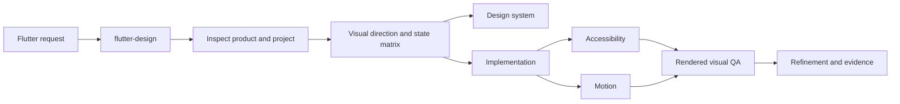

<div align="center">

# Flutter Design Engineer

**Agent skills for product-aware, adaptive, accessible, and visually verified Flutter UI.**

[](https://github.com/musabekisakov-imj/flutter-design-engineer/actions/workflows/validate.yml)
[](LICENSE)
[](examples/connected-command-center/demo)

</div>

## Same model. Same prompt. Different workflow.

Flutter Design Engineer is a model-agnostic skill system for Claude Code, Codex, and compatible coding agents. It changes the workflow around the model: establish product intent, define states and visual direction, implement adaptively, then inspect rendered evidence.

```text
inspect → understand → direct → model states → implement → render → critique → refine
```

| One-shot generation risk | Skill-guided workflow requirement |
| --- | --- |
| Starts writing widgets from a vague brief | Establishes product intent and an explicit direction first |
| Optimizes for one screenshot size | Requires compact mobile and expanded tablet/desktop composition |
| Shows only the happy path | Models loading, empty, partial, error, and success states |
| Treats accessibility as cleanup | Includes semantics, focus, scaling, RTL, and reduced motion |
| Calls source code “polished” | Requires rendered screenshots, critique, and refinement |

This table describes workflow requirements, not measured model results. The [reproducible benchmark protocol](benchmarks/connected-command-center) is ready; Claude, Codex, and Grok rows remain pending until each has completed a controlled baseline and skill-guided pair.

## One connected quality bar

The repository includes a real, deterministic Flutter fixture connecting an AI workspace, project pulse, finance summary, and travel plan. It is one Flutter codebase adapting the same models and components across screen sizes—not separate mobile and web implementations.

| Flutter Mobile | Flutter Tablet / Desktop |
| --- | --- |
|  |  |

<p align="center"><strong>One Flutter codebase · adaptive across screen sizes</strong></p>


These are committed Flutter golden-test outputs—not design-tool exports. See the [demo source](examples/connected-command-center/demo) and [example rationale](examples/connected-command-center/README.md). The example demonstrates the system's standard; it is not a claim that the result was generated autonomously.

The fixture demonstrates all seven skills as one auditable workflow:

```text
audit → product direction → semantic system → adaptive implementation
      → accessibility + motion → rendered visual QA → refinement
```

## Skills

| Skill | Purpose |
| --- | --- |
| `flutter-design` | Route and gate complete design workflows |
| `flutter-audit` | Diagnose existing Flutter UI without unauthorized edits |
| `flutter-design-system` | Build semantic tokens, themes, and component contracts |
| `flutter-implementation` | Implement approved adaptive Flutter interfaces |
| `flutter-motion` | Add purposeful, interruptible, accessible motion |
| `flutter-accessibility` | Harden semantics, focus, text scaling, RTL, and localization |
| `flutter-visual-qa` | Verify rendered states, breakpoints, themes, and goldens |

Each skill is self-contained: install one specialist or the full set without broken shared references.

## Install

Clone and install all skills into your agent's skill directory:

```bash
git clone https://github.com/musabekisakov-imj/flutter-design-engineer.git
cd flutter-design-engineer
python3 scripts/install.py --destination ~/.codex/skills
```

For Claude Code:

```bash
python3 scripts/install.py --destination ~/.claude/skills
```

Install selected skills:

```bash
python3 scripts/install.py \
  --destination ~/.codex/skills \
  --skill flutter-design \
  --skill flutter-visual-qa
```

The installer performs local copies only and refuses to overwrite existing skills unless `--force` is supplied. Host capabilities differ: screenshot capture, UI control, and automatic discovery depend on the environment.

## Use

Start broad:

```text
Use $flutter-design to turn this multi-domain dashboard into one coherent adaptive product without changing backend behavior.
```

Or invoke a specialist directly:

```text
Use $flutter-audit to review these Flutter screens. Do not edit code.
Use $flutter-accessibility to test checkout at 200% text scale and RTL.
Use $flutter-visual-qa to compare compact, tablet, light, and dark states.
```

## How the system routes work



Detailed guidance loads only when required. This keeps the entry skill concise while preserving deep specialist workflows.

## Verify

Repository checks:

```bash
python3 scripts/validate_repository.py
python3 -m unittest discover -s tests -v
```

Flutter fixture checks:

```bash
cd examples/connected-command-center/demo
flutter analyze
flutter test --exclude-tags golden
```

Regenerate screenshots intentionally:

```bash
flutter test --update-goldens
```

Goldens are rendered and reviewed on macOS; font rasterization differs across operating systems. CI runs platform-independent widget behavior tests and analyzer checks. Inspect every changed golden before accepting it.

## Design principles

- Product intent precedes aesthetics.
- Visual direction precedes implementation.
- Relevant states are designed explicitly.
- Constraints drive adaptive composition.
- Accessibility is part of correctness.
- Rendered evidence precedes claims of polish.
- Distinctiveness comes from coherent decisions, not decorative noise.
- Existing architecture and business behavior are preserved by default.

## Project status

This project is new and actively seeking real-world validation. It does not claim adoption, download, or contributor numbers it has not earned. See the [roadmap](ROADMAP.md), try it on a Flutter project, and share a reproducible issue or improvement.

## Contributing

Start with an issue labelled `good first issue` or propose a focused eval. Behavioral changes should update an eval case and keep all checks green. See [CONTRIBUTING.md](CONTRIBUTING.md) and our [Code of Conduct](CODE_OF_CONDUCT.md).

## License

MIT. The bundled Roboto and Material Icons fonts used by the deterministic demo are distributed under their upstream Apache 2.0 terms; see [font notices](examples/connected-command-center/demo/assets/fonts/NOTICE.md).
