<div align="center">

# Flutter Design Engineer

**Agent skills for product-aware, adaptive, accessible, and visually verified Flutter UI.**

[](https://github.com/musabekisakov-imj/flutter-design-engineer/actions/workflows/validate.yml)
[](LICENSE)
[](examples/connected-command-center/demo)

</div>

## Same model. Same prompt. Different workflow.

Flutter Design Engineer is a model-agnostic skill system for Claude Code, Codex, and compatible coding agents. It changes the workflow around the model: establish product intent, define states and visual direction, implement adaptively, then inspect rendered evidence.

```text
inspect → understand → direct → model states → implement → render → critique → refine
```

| One-shot generation risk | Skill-guided workflow requirement |
| --- | --- |
| Starts writing widgets from a vague brief | Establishes product intent and an explicit direction first |
| Optimizes for one screenshot size | Requires compact mobile and expanded tablet/desktop composition |
| Shows only the happy path | Models loading, empty, partial, error, and success states |
| Treats accessibility as cleanup | Includes semantics, focus, scaling, RTL, and reduced motion |
| Calls source code “polished” | Requires rendered screenshots, critique, and refinement |

This table describes workflow requirements, not measured model results. The [reproducible benchmark protocol](benchmarks/connected-command-center) is ready; Claude, Codex, and Grok rows remain pending until each has completed a controlled baseline and skill-guided pair.

## Flutter Product Studio

The primary mobile showcase is a deterministic AI-assisted workspace for Flutter teams. One Aurora project moves through Workspace, AI Audit, Design System, Adaptive Preview, Visual QA, and Release using a single cross-platform design system.

| Workspace | AI Audit | Design System |
| --- | --- | --- |
| 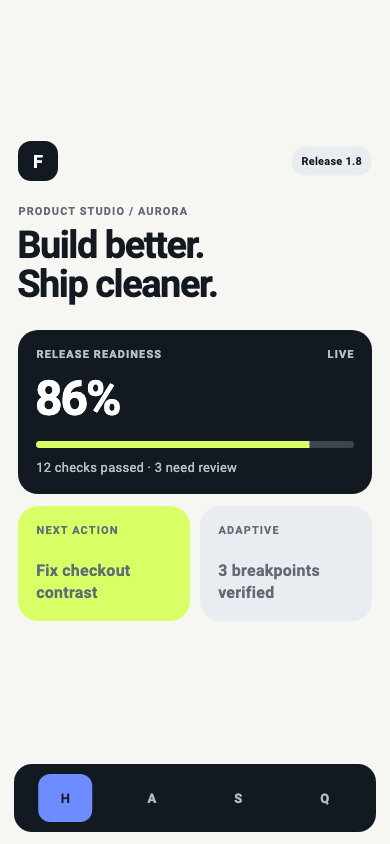 | 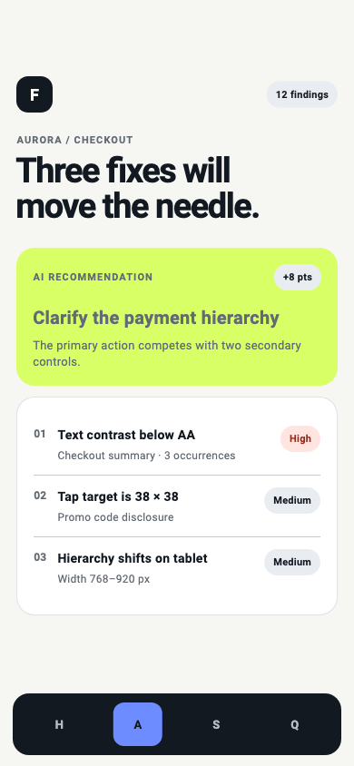 | 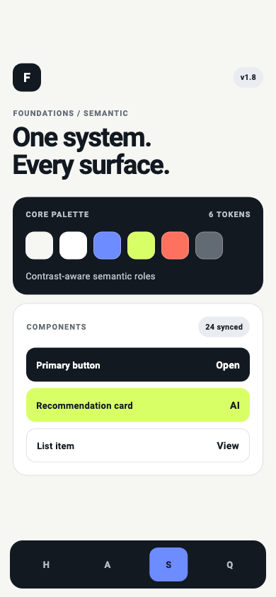 |

| Adaptive Preview | Visual QA | Release |
| --- | --- | --- |
| 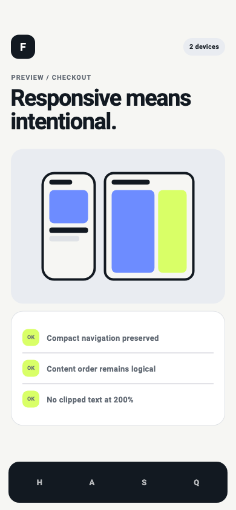 | 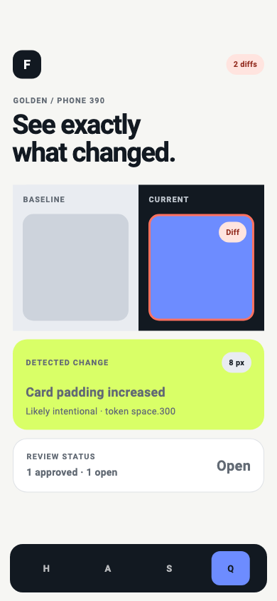 | 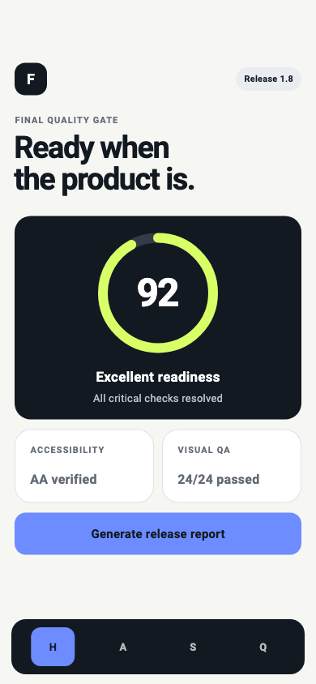 |

These are committed Flutter golden-test outputs generated from local fixture data. The example does not call a live AI service or production backend. See the [source, states, and verification commands](examples/product-studio/README.md).

## One connected quality bar

The repository includes a real, deterministic Flutter fixture connecting an AI workspace, project pulse, finance summary, and travel plan. It is one Flutter codebase adapting the same models and components across screen sizes—not separate mobile and web implementations.

| Flutter Mobile | Flutter Tablet / Desktop |
| --- | --- |
|  |  |

<p align="center"><strong>One Flutter codebase · adaptive across screen sizes</strong></p>

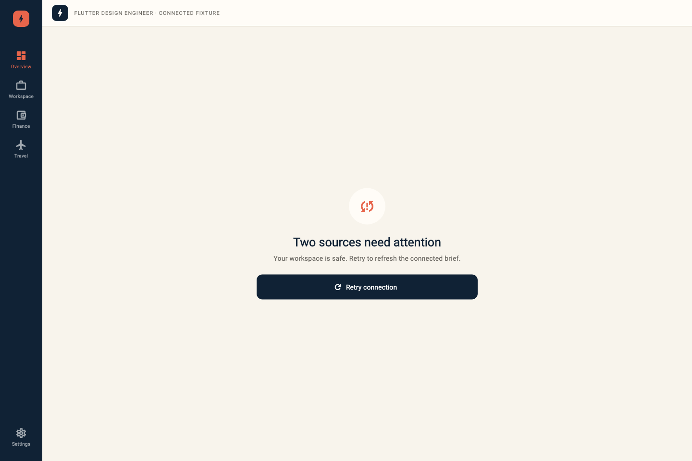

These are committed Flutter golden-test outputs—not design-tool exports. See the [demo source](examples/connected-command-center/demo) and [example rationale](examples/connected-command-center/README.md). The example demonstrates the system's standard; it is not a claim that the result was generated autonomously.

The fixture demonstrates all seven skills as one auditable workflow:

```text
audit → product direction → semantic system → adaptive implementation
      → accessibility + motion → rendered visual QA → refinement
```

## A verified mobile flow

The second fixture exercises the workflow against a complete booking journey. Its purpose is technical verification: forms, validation, unavailable slots, recovery, safe revision, 200% text scaling, and a real tablet recomposition.

| Service | Barber | Date and time |
| --- | --- | --- |
| 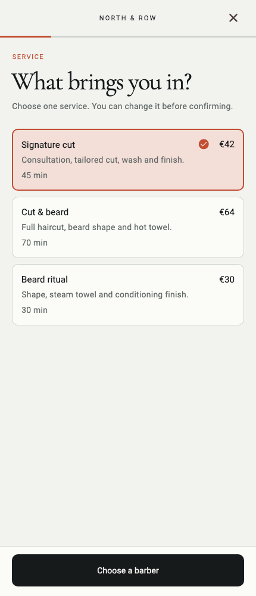 | 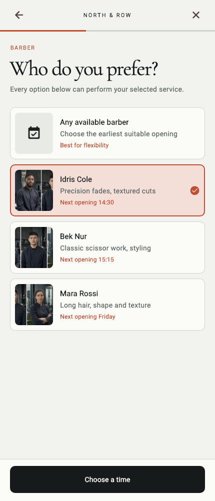 | 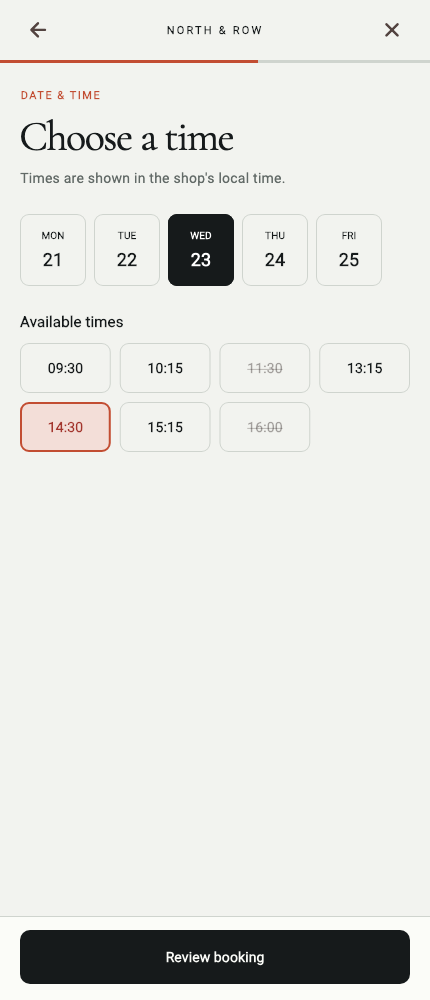 |

| Review | Confirmation | Recoverable availability error |
| --- | --- | --- |
| 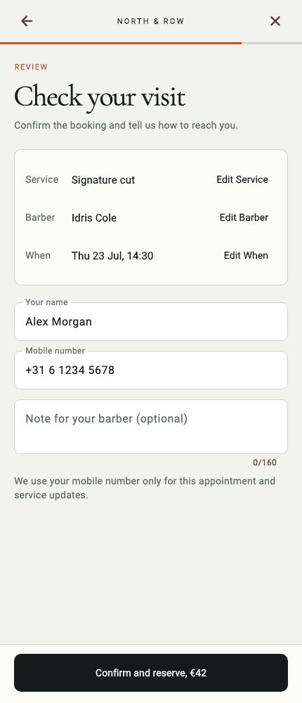 | 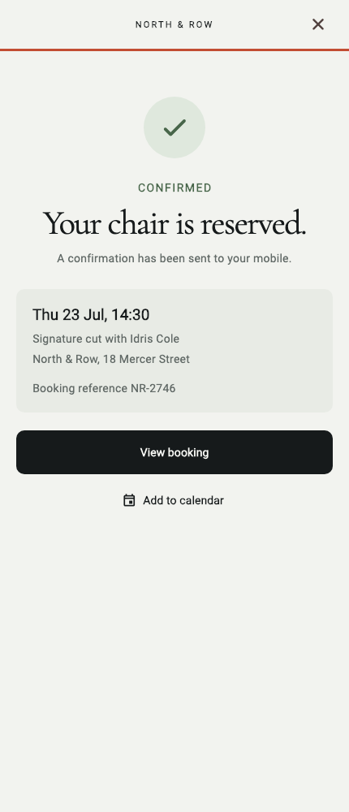 | 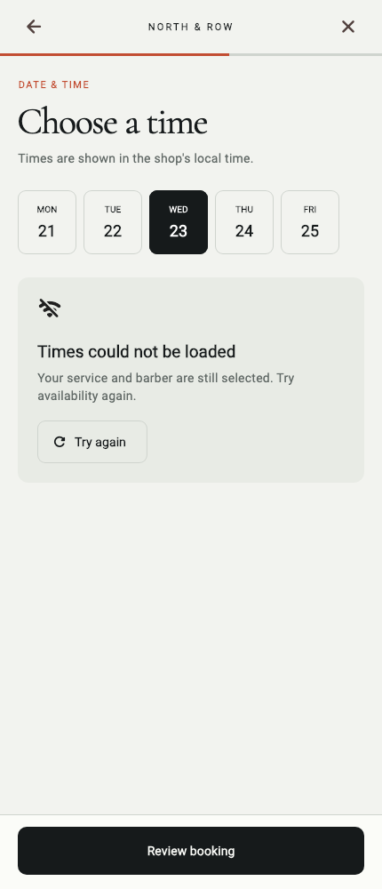 |

The [fixture source and verification notes](examples/barbershop-booking/README.md) distinguish authored prototype work from Flutter evidence. The separate [HTML design companion](docs/prototypes/editorial-barbershop-booking/) was used for direction review only; the screenshots above were rendered by Flutter golden tests.

## Skills

| Skill | Purpose |
| --- | --- |
| `flutter-design` | Route and gate complete design workflows |
| `flutter-audit` | Diagnose existing Flutter UI without unauthorized edits |
| `flutter-design-system` | Build semantic tokens, themes, and component contracts |
| `flutter-implementation` | Implement approved adaptive Flutter interfaces |
| `flutter-motion` | Add purposeful, interruptible, accessible motion |
| `flutter-accessibility` | Harden semantics, focus, text scaling, RTL, and localization |
| `flutter-visual-qa` | Verify rendered states, breakpoints, themes, and goldens |

Each skill is self-contained: install one specialist or the full set without broken shared references.

## Install

### Quick Start

> **Want a guided setup?** Open the
> [Interactive Install Guide](https://musabekisakov-imj.github.io/flutter-design-engineer/)
> for agent-specific commands, copy controls, verification, and troubleshooting.

> [!TIP]
> **Recommended — one command, guided setup.** The open
> [skills CLI](https://skills.sh/docs/cli) detects supported agents, lets you
> choose the destination, and installs all seven Flutter specialists.

```bash
npx skills add musabekisakov-imj/flutter-design-engineer
```

**Requires:** Node.js with `npx` · **Installs:** 7 self-contained skills ·
**Works with:** Claude Code, Codex, Gemini CLI, Cursor, and other skill-aware
agents. Start a new agent session when installation finishes.

Want to inspect the package first?

```bash
npx skills add musabekisakov-imj/flutter-design-engineer --list
```

### Choose your agent

<table>
  <tr>
    <td width="50%" valign="top">
      <p>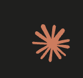</p>
      <h3>Claude Code</h3>
      <p><strong>Personal · all projects</strong></p>
      <p>Best when you want the Flutter workflow available in every Claude Code session.</p>
      <p><strong>Destination</strong><br><code>~/.claude/skills</code></p>
      <p><strong>From an existing clone</strong><br><code>python3 scripts/install.py --destination ~/.claude/skills</code></p>
    </td>
    <td width="50%" valign="top">
      <p>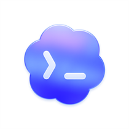</p>
      <h3>Codex</h3>
      <p><strong>Personal · all projects</strong></p>
      <p>Best when the complete design-to-verification workflow should be available across Codex tasks.</p>
      <p><strong>Destination</strong><br><code>~/.codex/skills</code></p>
      <p><strong>From an existing clone</strong><br><code>python3 scripts/install.py --destination ~/.codex/skills</code></p>
    </td>
  </tr>
  <tr>
    <td width="50%" valign="top">
      <p>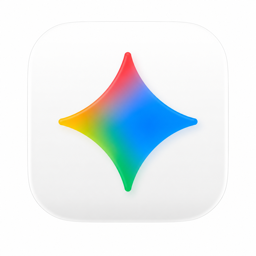</p>
      <h3>Gemini CLI</h3>
      <p><strong>Project · current repository</strong></p>
      <p>Best for a project-owned setup that can travel with the repository when committed.</p>
      <p><strong>Destination</strong><br><code>.gemini/skills</code></p>
      <p><strong>From an existing clone</strong><br><code>python3 scripts/install.py --destination .gemini/skills</code></p>
    </td>
    <td width="50%" valign="top">
      <p>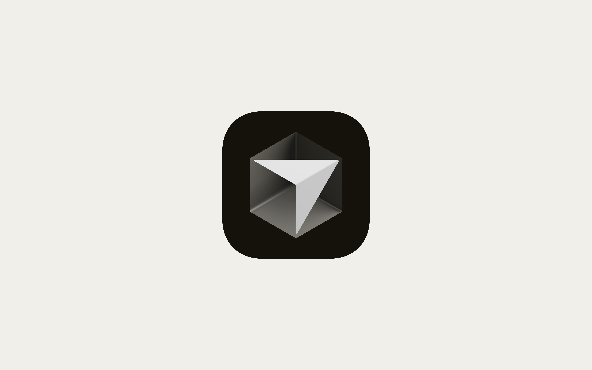</p>
      <h3>Cursor</h3>
      <p><strong>Project · current repository</strong></p>
      <p>Best when Cursor should discover the Flutter specialists only inside the opened repository.</p>
      <p><strong>Destination</strong><br><code>.cursor/skills</code></p>
      <p><strong>From an existing clone</strong><br><code>python3 scripts/install.py --destination .cursor/skills</code></p>
    </td>
  </tr>
</table>

### Direct install — no skills CLI

Use this route if Node.js is unavailable. It clones through HTTPS into a
temporary directory and copies the skills to the selected destination.

<details>
<summary><strong>Claude Code</strong> · personal, all projects</summary>

```bash
fde_install_dir="$(mktemp -d)" && \
git clone --depth 1 https://github.com/musabekisakov-imj/flutter-design-engineer.git "$fde_install_dir" && \
python3 "$fde_install_dir/scripts/install.py" --destination ~/.claude/skills
```

</details>

<details>
<summary><strong>Codex</strong> · personal, all projects</summary>

```bash
fde_install_dir="$(mktemp -d)" && \
git clone --depth 1 https://github.com/musabekisakov-imj/flutter-design-engineer.git "$fde_install_dir" && \
python3 "$fde_install_dir/scripts/install.py" --destination ~/.codex/skills
```

</details>

<details>
<summary><strong>Gemini CLI</strong> · current project</summary>

```bash
fde_install_dir="$(mktemp -d)" && \
git clone --depth 1 https://github.com/musabekisakov-imj/flutter-design-engineer.git "$fde_install_dir" && \
python3 "$fde_install_dir/scripts/install.py" --destination .gemini/skills
```

</details>

<details>
<summary><strong>Cursor</strong> · current project</summary>

```bash
fde_install_dir="$(mktemp -d)" && \
git clone --depth 1 https://github.com/musabekisakov-imj/flutter-design-engineer.git "$fde_install_dir" && \
python3 "$fde_install_dir/scripts/install.py" --destination .cursor/skills
```

</details>

### Customize and maintain

**Install only selected skills** from an existing clone:

```bash
python3 scripts/install.py \
  --destination ~/.codex/skills \
  --skill flutter-design \
  --skill flutter-visual-qa
```

**Update intentionally.** The installer protects existing directories. Review
your current installation, then add `--force` only when you want to replace it:

```bash
python3 scripts/install.py --destination ~/.codex/skills --force
```

**Verify the result.** The selected destination should contain seven
`flutter-*` directories:

```bash
find ~/.codex/skills -maxdepth 1 -type d -name 'flutter-*' | sort
```

### Troubleshooting

| Problem | What to do |
| --- | --- |
| `npx: command not found` | Install Node.js, or use the Python-based direct install above. |
| Destination already exists | Review the installed files; rerun with `--force` only if replacement is intended. |
| Agent does not discover the skills | Confirm the destination, then fully start a new agent session. |
| GitHub SSH permission error | Use the HTTPS commands above; they do not require a GitHub SSH key. |

### First run

Open a new session in your agent, enter your Flutter repository, and try:

```text
Use $flutter-design to audit this app, design an approved adaptive UX,
implement it with the project design system, check accessibility, and verify
the rendered result with screenshots.
```

Host capabilities differ: screenshot capture, UI control, and automatic skill
discovery depend on the environment.

## Use

Start broad:

```text
Use $flutter-design to turn this multi-domain dashboard into one coherent adaptive product without changing backend behavior.
```

Or invoke a specialist directly:

```text
Use $flutter-audit to review these Flutter screens. Do not edit code.
Use $flutter-accessibility to test checkout at 200% text scale and RTL.
Use $flutter-visual-qa to compare compact, tablet, light, and dark states.
```

## How the system routes work

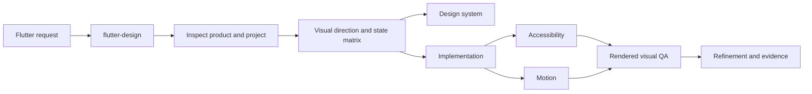

Detailed guidance loads only when required. This keeps the entry skill concise while preserving deep specialist workflows.

## Verify

Repository checks:

```bash
python3 scripts/validate_repository.py
python3 -m unittest discover -s tests -v
```

Flutter fixture checks:

```bash
cd examples/connected-command-center/demo
flutter analyze
flutter test --exclude-tags golden
```

Regenerate screenshots intentionally:

```bash
flutter test --update-goldens
```

Goldens are rendered and reviewed on macOS; font rasterization differs across operating systems. CI runs platform-independent widget behavior tests and analyzer checks. Inspect every changed golden before accepting it.

## Design principles

- Product intent precedes aesthetics.
- Visual direction precedes implementation.
- Relevant states are designed explicitly.
- Constraints drive adaptive composition.
- Accessibility is part of correctness.
- Rendered evidence precedes claims of polish.
- Distinctiveness comes from coherent decisions, not decorative noise.
- Existing architecture and business behavior are preserved by default.

## Project status

This project is new and actively seeking real-world validation. It does not claim adoption, download, or contributor numbers it has not earned. See the [roadmap](ROADMAP.md), try it on a Flutter project, and share a reproducible issue or improvement.

## Contributing

Start with an issue labelled `good first issue` or propose a focused eval. Behavioral changes should update an eval case and keep all checks green. See [CONTRIBUTING.md](CONTRIBUTING.md) and our [Code of Conduct](CODE_OF_CONDUCT.md).

## License

MIT. The bundled Roboto and Material Icons fonts used by the deterministic demo are distributed under their upstream Apache 2.0 terms; see [font notices](examples/connected-command-center/demo/assets/fonts/NOTICE.md).
