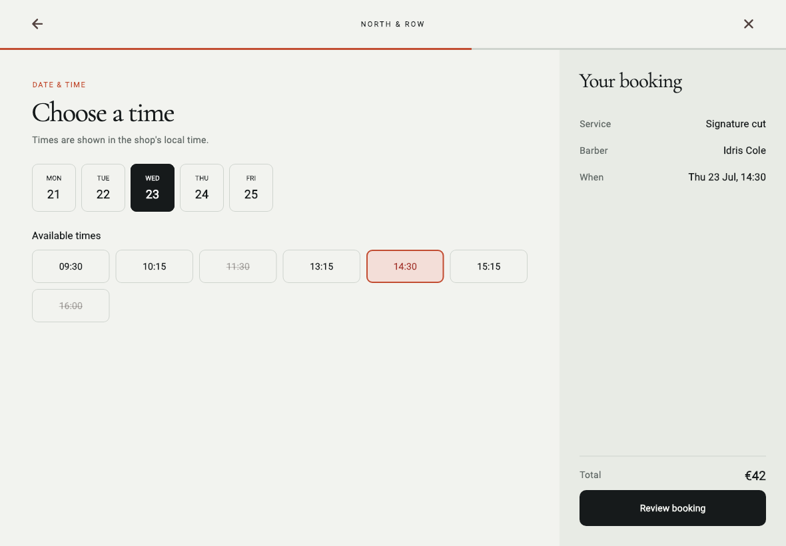

# Editorial Barbershop Booking Example

This deterministic Flutter fixture demonstrates a complete customer booking journey rather than a single polished screen. It is isolated from any production application or backend.

| Service | Barber | Availability |
| --- | --- | --- |
|  |  |  |

| Review | Confirmation | Recoverable error |
| --- | --- | --- |
|  |  |  |

These images are Flutter golden-test outputs with deterministic local fixtures, fonts, icons, time, and artwork.

## Product contract

A new or returning client should be able to reserve a service without calling the shop. The flow answers four questions in order: what service, which barber, what genuinely available time, and what will be reserved.

The controller preserves independent input and invalidates only dependent choices. Changing a service clears barber and availability while keeping customer details. Availability failure preserves earlier decisions. A slot that becomes unavailable explains what changed and offers nearby alternatives.

## Implemented states

- service, barber, date/time, review, and confirmation;
- loading, empty, recoverable availability error, and invalidated slot;
- disabled continue and confirm actions;
- inline name and phone validation;
- submission progress and duplicate-submit prevention;
- compact phone and expanded tablet composition;
- 200% text scaling, RTL structural safety, and reduced motion.

## Adaptive behavior

Phone uses a single scrollable decision area with a safe persistent action. Tablet recomposes into an active decision region and a persistent booking summary. It is not a stretched phone column.



## Verification

```bash
cd demo
flutter analyze
flutter test --exclude-tags golden
flutter test
```

Regenerate screenshots only when the visual change is intentional:

```bash
flutter test --update-goldens test/booking_golden_test.dart
```

The committed matrix covers phone service, barber, availability, review, confirmation, availability error, 200% review text, and expanded availability. The implementation is light-theme only and uses local data. It does not claim backend, authentication, payment, or production deployment readiness.

## Seven-skill workflow

1. `flutter-audit` identified hierarchy, state, and adaptation risks in the previous showcase.
2. `flutter-design` established the focused customer journey and Editorial Craft direction.
3. `flutter-design-system` defined semantic surfaces, content, accent, typography, geometry, and component states.
4. `flutter-implementation` separated deterministic state, orchestration, and adaptive presentation.
5. `flutter-motion` added a short interruptible step transition with a reduced-motion equivalent.
6. `flutter-accessibility` covered semantics, targets, validation, text scaling, RTL, and reduced motion.
7. `flutter-visual-qa` rendered the matrix, found font and asset defects, and required refinement before approval.
