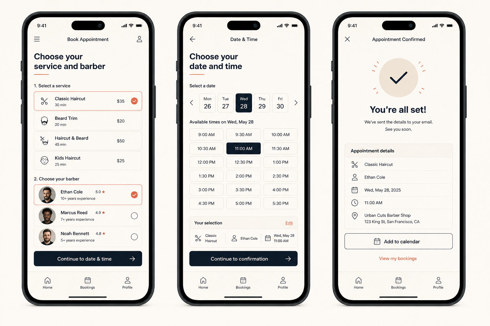

# Booking Redesign Example

This example defines a reproducible eval fixture rather than prescribing one visual style. It now includes a real [Flutter demo](demo) with deterministic compact and expanded golden screenshots.

## Visual direction reference



This image is an AI-generated art-direction reference used to establish palette, density, hierarchy, and flow. The screenshots in `demo/goldens/` are rendered by Flutter and are the implementation evidence.

Run the demo:

```bash
cd demo
flutter run -d chrome
```

Verify and regenerate screenshots:

```bash
flutter analyze
flutter test
flutter test --update-goldens
```

## Product

A returning customer books a service, staff member, and available time. The critical action is confirming a valid appointment quickly without losing context when availability changes.

## Required states

- services loading, loaded, and unavailable;
- staff set to “any” or a specific person;
- date with slots, no slots, stale slots, and network failure;
- submitting, conflict, success, and retry;
- compact and expanded layouts;
- light/dark, enlarged text, and RTL.

## Behavioral contracts

- Preserve the selected service when changing dates.
- Revalidate the slot before confirmation.
- Keep server errors distinguishable from slot conflicts.
- Never expose unavailable slots as selectable.
- Return a stable appointment identifier on success.

## Expected workflow artifacts

1. Repository and behavior inventory.
2. One approved visual-direction statement.
3. State matrix and adaptive composition notes.
4. Semantic token decisions.
5. Focused implementation diff.
6. Analyzer and test output.
7. Rendered matrix with a visual-QA refinement pass.
