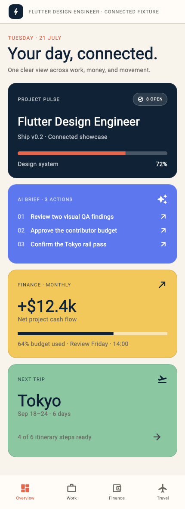
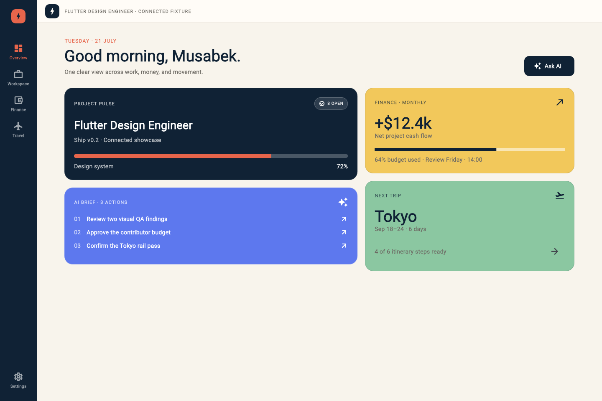

# Connected Command Center Example

This example is a reproducible Flutter fixture showing how the seven skills collaborate on one multi-domain product. It combines project work, finance, travel, and an AI action brief without depending on a backend or network.

| Compact | Expanded |
| --- | --- |
|  |  |

The screenshots are rendered by Flutter golden tests and are the implementation evidence.

## Run

```bash
cd demo
flutter run -d chrome
```

Verify and regenerate screenshots:

```bash
flutter analyze
flutter test --exclude-tags golden
flutter test --update-goldens
```

## Product

A maintainer needs one clear view of project delivery, budget health, and an upcoming trip. The AI brief connects the domains by identifying the few actions that need attention now.

## Required states

- connected data loading;
- fully populated command center;
- recoverable source error;
- no connected sources;
- compact and expanded constraints;
- enlarged text, keyboard navigation, semantics, and reduced motion.

## Behavioral contracts

- Keep unaffected domain data visible when one source fails.
- Preserve domain identity without fragmenting the shared design system.
- Keep semantic and keyboard order aligned with visual priority.
- Adapt the same components rather than creating separate mobile and desktop products.
- Make every error state identify impact, safety, and recovery.

## Seven-skill workflow

1. Audit hierarchy, density, state ownership, and adaptation risks.
2. Establish the connected-product narrative and visual direction.
3. Define semantic tokens and domain accents.
4. Implement shared compact and expanded components.
5. Verify semantics, focus, text scaling, and reduced motion.
6. Specify purposeful state and navigation transitions.
7. Render and inspect the populated and recovery matrix.
